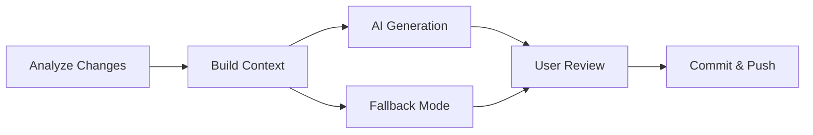

# 🤖 Smart Git Commit Tool

<div align="center">


**Never write commit messages again!** 🚀

_An intelligent git commit tool that uses Google's Gemini AI to automatically generate professional, meaningful commit messages based on your code changes._

[🚀 Quick Start](#-quick-start) • [📖 Features](#-features) • [💻 Installation](#-installation) • [🎯 Usage](#-usage) • [🔧 Configuration](#-configuration)

</div>

---

## ✨ Features

<table>
<tr>
<td>

🤖 **AI-Powered Messages**
Uses Gemini AI to analyze your changes and generate meaningful commit messages

📝 **Conventional Commits**
Follows industry-standard format (`feat:`, `fix:`, `docs:`, etc.)

🔍 **Smart Analysis**
Analyzes file changes, diffs, and recent commit history for context

</td>
<td>

💬 **Interactive Mode**
Review and edit AI suggestions before committing

🚀 **Batch Operations**
Stage, commit, and push in one command

🛡️ **Fallback Mode**
Works perfectly without AI when API key is not available

</td>
</tr>
</table>

## 🚀 Quick Start

```bash
# 1. Clone the repository
git clone https://github.com/LinuxCTRL/smart-git-commit.git
cd smart-git-commit

# 2. Install dependencies
pip install requests

# 3. Set up your API key (optional but recommended)
export GEMINI_API_KEY="your-api-key-here"

# 4. Start using it!
python3 smart_commit.py
```

**Or install globally:**

```bash
chmod +x install.sh && ./install.sh
smart-commit  # Use from anywhere!
```

## 🎯 Usage

### 🎮 Interactive Mode (Recommended)

```bash
python3 smart_commit.py
```

<details>
<summary>📺 See example output</summary>

```
🔍 Analyzing repository changes...

📊 Changes Summary:
  ➕ Added: 2 files
  ✏️  Modified: 3 files

🤖 Generating commit message...

💡 Suggested commit message:
   feat: add user authentication system

❓ Use this message? (Y/n/e): y

✅ Staged all changes
✅ Committed successfully: feat: add user authentication system

❓ Push to remote? (y/N): y
✅ Pushed to origin
```

</details>

### ⚡ Quick Commands

```bash
# Auto-stage and commit with AI message
python3 smart_commit.py -a

# Auto-stage, commit, and push
python3 smart_commit.py -a -p

# Use custom message
python3 smart_commit.py -a -m "fix: resolve authentication bug"

# Preview what would happen (dry run)
python3 smart_commit.py --dry-run
```

### 🌍 Global Usage (After Installation)

```bash
smart-commit              # Interactive mode
smart-commit -a           # Auto-stage and commit
smart-commit -a -p        # Auto-stage, commit, and push
smart-commit --dry-run    # Preview mode
```

## 💻 Installation

### Option 1: Automated Installer (Recommended)

```bash
curl -sSL https://raw.githubusercontent.com/LinuxCTRL/smart-git-commit/main/install.sh | bash
```

### Option 2: Manual Installation

```bash
git clone https://github.com/LinuxCTRL/smart-git-commit.git
cd smart-git-commit
chmod +x install.sh
./install.sh
```

### Option 3: Portable Usage

```bash
# Download just the main script
curl -O https://raw.githubusercontent.com/LinuxCTRL/smart-git-commit/main/smart_commit.py
pip install requests
python3 smart_commit.py
```

## 🔧 Configuration

### 🔑 API Key Setup

1. **Get your free API key** from [Google AI Studio](https://makersuite.google.com/app/apikey)
2. **Set environment variable:**

   ```bash
   # Add to ~/.bashrc or ~/.zshrc
   export GEMINI_API_KEY="your-api-key-here"

   # Or set temporarily
   export GEMINI_API_KEY="your-key"
   ```

3. **Or pass directly:**
   ```bash
   python3 smart_commit.py --api-key "your-key"
   ```

> **💡 Pro Tip:** The tool works great even without an API key using intelligent fallback logic!

### 🎨 Commit Message Format

Generated messages follow [Conventional Commits](https://www.conventionalcommits.org/) specification:

| Type       | Description      | Example                      |
| ---------- | ---------------- | ---------------------------- |
| `feat`     | New features     | `feat: add user dashboard`   |
| `fix`      | Bug fixes        | `fix: resolve login issue`   |
| `docs`     | Documentation    | `docs: update API guide`     |
| `style`    | Code formatting  | `style: fix indentation`     |
| `refactor` | Code refactoring | `refactor: optimize queries` |
| `test`     | Tests            | `test: add unit tests`       |
| `chore`    | Maintenance      | `chore: update dependencies` |

## 🛠️ How It Works



1. **🔍 Change Analysis** - Scans git status and diffs
2. **🧠 Context Building** - Gathers file changes, diffs, and commit history
3. **🤖 AI Generation** - Sends context to Gemini AI for message generation
4. **👤 User Review** - Present message for approval/editing
5. **✅ Git Operations** - Stage, commit, and optionally push

## 🚨 Troubleshooting

<details>
<summary>🔑 API Key Issues</summary>

**"No API key found" warning:**

- Set `GEMINI_API_KEY` environment variable
- Or use `--api-key` parameter
- Tool works in fallback mode without AI

**API errors:**

- Verify your API key is valid
- Check internet connection
- Ensure you haven't exceeded API quotas

</details>

<details>
<summary>🗂️ Git Repository Issues</summary>

**"Not a git repository" error:**

- Make sure you're in a git repository
- Run `git init` if needed
- Check you have proper git permissions

</details>

<details>
<summary>🐍 Python Issues</summary>

**Import errors:**

- Install dependencies: `pip install requests`
- Ensure Python 3.7+ is installed
- Check your Python PATH

</details>

## 🤝 Contributing

We love contributions! Here are some ways to help:

- 🐛 **Report bugs** - Found an issue? Let us know!
- 💡 **Suggest features** - Have ideas? We'd love to hear them!
- 🔧 **Submit PRs** - Code contributions are welcome!
- 📖 **Improve docs** - Help make the documentation better!

### 🎯 Ideas for Contributions

- Support for other AI providers (OpenAI, Claude, Anthropic)
- Custom commit message templates
- Git hooks integration
- Multi-language support
- VS Code extension
- GitHub Actions integration

## 📄 License

This project is licensed under the MIT License - see the [LICENSE](LICENSE) file for details.

## ⭐ Show Your Support

If this tool helps you, please consider:

- ⭐ **Starring the repository**
- 🐦 **Sharing on social media**
- 💬 **Telling your friends and colleagues**

---

<div align="center">

**Made with ❤️ by developers, for developers**

[🚀 Get Started](#-quick-start) • [📖 Documentation](#-features) • [🤝 Contribute](#-contributing)

</div>
